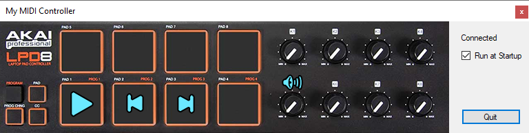

# MyMIDIController

## What
A simple program that receives MIDI input from a device and adjusts the system volume. For Windows.

A single Windows .exe is here: [/Releases/MyMIDIController.zip](Releases/MyMIDIController.zip)

## How
It uses [DryWetMidi](https://github.com/melanchall/drywetmidi) to connect to a device named "LPD8".

When the first potmeter is changed, it will change the system volume.

Pressing pad 1, 2, 3 will act as Play/Pause, Previous and Next media keys.

It will display a tray icon and will run at startup if requested.

Use Visual Studio 2019. Run on Windows.

## Why
I wanted to see how hard it is. Not very.
